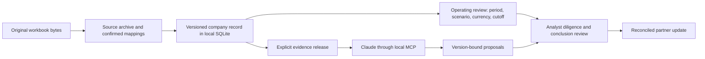

# Architecture and trust boundaries

Cooper Reed built the Desk as a maintained investment record. Excel owns financial modelling; the analyst confirms mappings and investment judgment. The Desk computes only supported arithmetic and records which evidence and assumptions support each output.

A bundled native launcher starts a loopback Node service and opens the browser. The service requires a local session token and checks browser origin on mutations. Its SQLite store retains original source bytes, mapping metadata, review events and adopted work. Optimistic concurrency rejects stale writes. Source availability and review cutoffs bound the monthly calculation and released evidence; cached Excel formula results are not recalculated by the Desk.

Model proposals are separate from analyst adoption. Private-company MCP retrieval is released and source-addressable; the static synthetic transaction MCP surface is a separate mode. A local connection proof verifies the packaged tool handshake; it is not proof that Claude Enterprise imported the extension on another computer.

The monthly engine compares explicitly defined monthly flows and period-end balances. Ambiguous definitions, durations, scenarios and unavailable evidence remain excluded or unsupported. Net debt and cash headroom are arithmetic implications, not inferred covenants, valuation, debt service coverage or annualized leverage. PE and VC transaction engines remain available only for their defined inputs.

Output dependencies become stale when evidence or the review basis changes. The analyst reconciles affected conclusions before saving the next output. Original workbooks are preserved; the change-table Excel export is separate.

## Local security limits

This is a single-device pilot, not firm-wide identity or authorization. A named reviewer is an actor label. Device account access and disk security protect the live database; encrypted backup does not mean the live database is application-encrypted at rest. A same-user process or a compromised device is outside the local token boundary. No enterprise security certification, tenant isolation or production availability is claimed.

Measurement is opt-in and local. It records task state, correction counts and bounded component timings, not company files, prompts or names. Sharing evidence with a model remains an explicit separate action, subject to the user's subscription and organizational policy.

The optional AWS directory is an undeployed synthetic endpoint. It does not move the company database or accept private documents.
